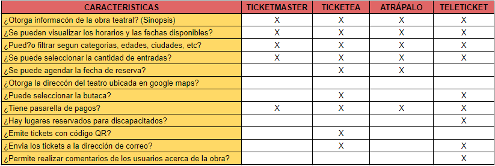
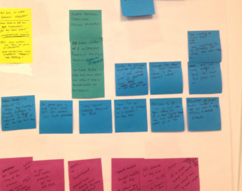

# JOINNUS

Joinnus es una plataforma que conecta personas con los mismos intereses permitiendo a usuarios y a empresas la creación, difusión, gestión y cobro de eventos en Lima y en todo el país de manera sencilla, eficaz y gratuita.

## El Reto

**¿Cómo podemos mejorar la experiencia de usuario al momento de comprar entradas numeradas para un teatro de uno o varios pisos?**

### Para UX
- Informe de estudio de validación de interfaces UX UI (web y móvil) con usuarios
potenciales.
- Optimización de interfaces UX UI (web y móvil) en función a los inputs dados por
usuarios potenciales.

### Puntos que se deben tener en consideración
- En el plano general del mapa se debe de mostrar el mapa por completo con las zonas a
escoger diferenciadas por colores.
- Al escoger la zona del mapa mediante un clic este debe de abrirse mostrando los
asientos según la forma de la zona escogida.
- Debe de mostrar una leyenda de los colores según los asientos.
- Los asientos se deben de diferenciar según su disponibilidad por colores.
- Si esta ocupado no debe permitirte escoger el asiento.
- Si está libre el asiento al escoger se debe de pintar el asiento del color de la selección.
- Si no se llega a escoger un asiento y quiere continuar con la compra, este debe de
mostrar una alerta indicando que debe de escoger el asiento.
- También de haber botón de zoom que permitirá alejar y acercar el mapa de la zona de
los asientos.
- También deberá de haber un botón que te permita retroceder y te llevará al mapa
general en donde se podrá escoger otra zona.
- Considerar tipos de asientos. Ejemplo Al escoger un asiento me debe de mostrar
opciones de tipo de asiento (Adulto, niño, discapacitado, etc)

## I. DESCUBRIMIENTO E INVESTIGACIÓN

### RECOPILACIÓN Y ANÁLISIS  DE DATOS

#### ENCUESTAS

aqui van los datos de la encuesta, están en el drive

#### ENTREVISTAS

aqui van los datos de la entrevista, están en el drive

#### BENCHMARK

Referencia de otras webs que realizan la compra de tickets tipo teatro.

#### DIAGRAMA DE AFINIDAD

Luego de haber realizado las encuestas, entrevistas y benchmark, se realizó un mapa de afinidad para poder detectar los problemas más resaltantes.

**Se dectectaron los siguientes problemas:**

- Las colas (Debido a que en muchas de las plataformas no se pueden visualizar y seleccionar las butacas)
- Horarios (problemas)
- Información al clientes (problemas)
- Problemas (diseño) (problemas)